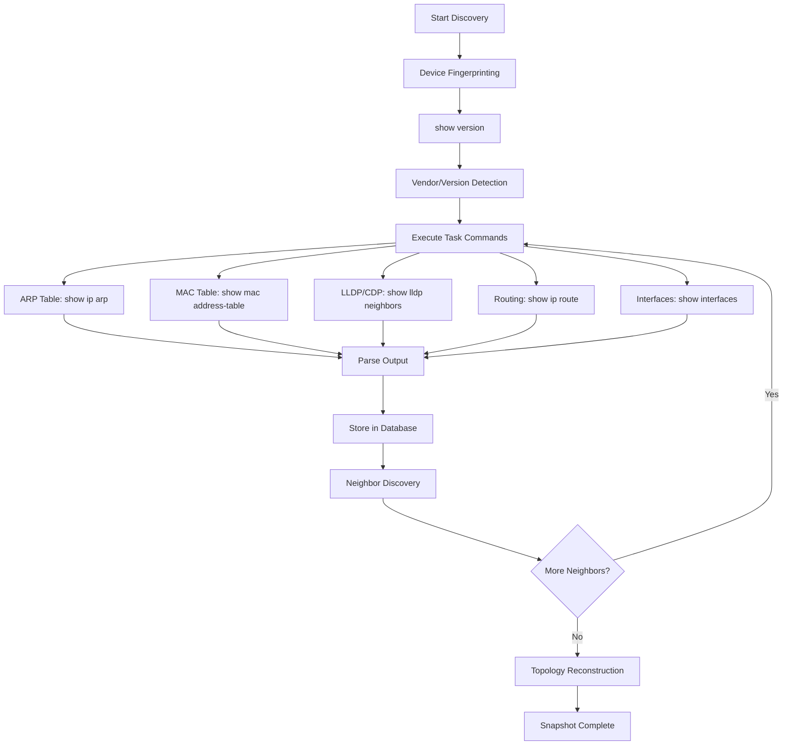

# IP Fabric - Analisi Implementazione MAC Address Lookup

**Data ricerca**: 2025-12-21
**Ricercatore**: Technical Researcher Agent
**Obiettivo**: Comprendere come IP Fabric implementa il MAC tracing e path lookup

---

## Executive Summary

IP Fabric utilizza un approccio **snapshot-based** con un **mathematical network model** che ricostruisce l'intera topologia della rete (layer 2 e layer 3) in memoria. Il MAC lookup non è una ricerca real-time ma una **simulazione end-to-end** su dati già raccolti e processati.

### Differenze Chiave vs NetMap

| Aspetto | IP Fabric | NetMap (attuale) |
|---------|-----------|------------------|
| **Architettura** | Snapshot completo della rete | Query on-demand (NeDi DB + SSH) |
| **Database** | PostgreSQL (multi-model) | MySQL (NeDi) + SQLite locale |
| **Performance lookup** | Istantanea (dati in RAM) | Variabile (10ms-60s) |
| **Dati** | Pre-processati e correlati | Raw da NeDi + SSH live |
| **Path simulation** | Mathematical model | Trace SSH hop-by-hop |
| **Caching** | Snapshot intero (GB in RAM) | Multi-level cache (60s-5min) |

---

## 1. Architettura del Sistema

### 1.1 Core Infrastructure

```
┌─────────────────────────────────────────┐
│         IP Fabric Platform              │
├─────────────────────────────────────────┤
│  Microservices Layer                    │
│  ┌──────────────────────────────────┐   │
│  │  Discovery Engine (SSH/Telnet)   │   │
│  │  - CLI command execution         │   │
│  │  - Multi-vendor parsing          │   │
│  │  - Worker flow control           │   │
│  └──────────────────────────────────┘   │
│                                          │
│  ┌──────────────────────────────────┐   │
│  │  Mathematical Network Model      │   │
│  │  - Topology reconstruction       │   │
│  │  - Protocol analysis (L2/L3)     │   │
│  │  - Dependency calculation        │   │
│  └──────────────────────────────────┘   │
│                                          │
│  ┌──────────────────────────────────┐   │
│  │  PostgreSQL Database             │   │
│  │  (ex-ArangoDB fino v7.5)         │   │
│  │  - Snapshot storage              │   │
│  │  - State tables (MAC/ARP/Route)  │   │
│  │  - 5 snapshots loaded in RAM     │   │
│  │  - 100+ snapshots on disk        │   │
│  └──────────────────────────────────┘   │
└─────────────────────────────────────────┘
```

**Fonti**:
- [IP Fabric Overview](https://docs.ipfabric.io/main/overview/)
- [IP Fabric v7.5 Release Notes](https://docs.ipfabric.io/7.5/releases/release_notes/7.5/)

### 1.2 Snapshot-Based Approach

**Concetto chiave**: IP Fabric non fa lookup real-time, ma crea **snapshot completi della rete**.

> "A network snapshot is a fully functional software copy of your network, including all configuration and state data."

**Gestione memoria**:
- **5 snapshot** caricati in RAM contemporaneamente
- **1 snapshot attivo** per discovery in corso
- **100+ snapshot** archiviati su disco (unloaded)
- Unload/Load richiede diversi minuti (dipende da dimensione rete)

**Performance impact**:
- Versioni < 7.8: +10% tempo calcolo per ogni snapshot caricato
- Versioni >= 7.8: +0.5-1% per snapshot (miglioramento 10x)

**Fonte**: [How Snapshots Work](https://docs.ipfabric.io/main/overview/snapshots/)

---

## 2. Discovery Process: Come Vengono Raccolti i Dati

### 2.1 CLI Discovery Workflow



### 2.2 Task-Based Collection

IP Fabric organizza la raccolta dati in **TASK** (technology-specific):

**Task fondamentali** (non disabilitabili):
- `Neighbors` - LLDP/CDP discovery
- `ARP` - Tabelle ARP (Layer 3 → MAC correlation)
- `Mac` - MAC address tables (Layer 2 forwarding)
- `RIB` - Routing Information Base
- `Interfaces` - Status, VLAN, trunking

**Comandi esempio (Cisco)**:
```bash
terminal length 0
show version
show inventory
show etherchannel summary
show interfaces status
show interfaces switchport
show ip int brief
show ip vrf
show ip arp                    # <-- ARP table
show ip route
show ip cef
show ip access-list
show cdp neighbors detail
show lldp neighbors detail
show mac address-table         # <-- MAC table
show spanning-tree detail
show standby brief
show vrrp brief
show vlan brief
```

**Multi-vendor support**:
- Cisco: `show ip arp`, `show mac address-table`
- HP Comware: `display arp`, `display mac-address`
- Huawei: `display arp`, `display mac-address`
- Extreme BOSS: vendor-specific parsing
- Palo Alto: `show arp management`
- Check Point: `show arp dynamic all` (con bug VSx noto)

**Fonti**:
- [How CLI Discovery Works](https://docs.ipfabric.io/main/overview/How_Discovery_Works/CLI_discovery/)
- [Discovery Tasks](https://docs.ipfabric.io/4.4/IP_Fabric_Settings/advanced/discovery_tasks/)

### 2.3 Performance Discovery

**Worker Flow Control**:
- Bandwidth limit configurabile (MB/s)
- Ogni +1 MB/s = +3 sessioni parallele
- Application-level traffic shaping
- Kernel-level bidirectional traffic shaper

**Ottimizzazioni**:
- `terminal length 0` per evitare paginazione
- Parsing incrementale output CLI
- OUI table filtering (evita connection inutili)
- Parallel session management

**Fonte**: [CLI Discovery](https://docs.ipfabric.io/main/overview/How_Discovery_Works/CLI_discovery/)

---

## 3. Path Lookup & MAC Tracing

### 3.1 Come Funziona il Path Lookup

**Modalità**:
1. **Unicast Path Lookup** - Traccia pacchetto da IP sorgente a IP destinazione
2. **Multicast Tree Lookup** - Visualizza distribuzione gruppo multicast
3. **Host-to-Gateway** - Analizza connettività host ↔ gateway

**Input utente**:
- Source IP (+ VRF opzionale)
- Destination IP
- Protocol (ICMP default, TCP/UDP opzionali)
- Ports (80/443 per HTTP/HTTPS)

**Output**:
- Visualizzazione grafica del percorso
- Decisioni di forwarding per ogni hop
- Policy matches (firewall, ACL)
- Tunnel endpoints (IPsec, VXLAN)

**Fonte**: [How To Use Path Lookup](https://docs.ipfabric.io/main/IP_Fabric_GUI/diagrams/how_to_use_path-lookup/)

### 3.2 Struttura Dati Path Lookup API

**Graph Result Structure**:

```json
{
  "graphResult": {
    "nodes": [
      {
        "id": "vDevice123",
        "label": "switch-core-01",
        "sn": "ABC123456",
        "type": "switch",
        "position": { "x": 100, "y": 200 }
      }
    ],
    "edges": [
      {
        "id": "node1:eth1/1-node2:eth2/1",
        "source": "node1",
        "target": "node2",
        "sourceInterface": "eth1/1",
        "targetInterface": "eth2/1"
      }
    ],
    "decisions": [
      {
        "device": "switch-core-01",
        "trafficIn": "GigabitEthernet1/0/1",
        "trafficOut": "GigabitEthernet1/0/24",
        "traces": [
          {
            "type": "switching-nexthop",
            "decision": "MAC table match",
            "details": {
              "macAddress": "aa:bb:cc:dd:ee:ff",
              "vlan": 100,
              "port": "GigabitEthernet1/0/24"
            }
          }
        ]
      }
    ]
  }
}
```

**Tipi di decisioni**:

| Tipo | Descrizione | Tabelle consultate |
|------|-------------|-------------------|
| `switching-nexthop` | Forwarding Layer 2 | **MAC address table** |
| `ip-routing` | Routing Layer 3 | **Routing table + ARP table** |
| `security` | Zone-based firewall | Security policies |
| `mpls-switching` | MPLS forwarding | VRF, MPLS labels, push/pop |

**Fonte**: [Path Lookup API Overview](https://docs.ipfabric.io/6.6/IP_Fabric_API/Path_Lookup/)

### 3.3 Correlazione MAC ↔ IP ↔ Porta

**Flow decisionale Layer 2**:

```
1. Pacchetto arriva su switch
2. Lookup MAC destinazione nella MAC table
3. Match trovato → forward su porta specifica
4. Match non trovato → flood su tutte le porte VLAN
```

**Flow decisionale Layer 3** (router/L3 switch):

```
1. Pacchetto arriva su router
2. Lookup IP destinazione nella routing table
3. Determina next-hop IP
4. Lookup next-hop IP nella ARP table
5. Ottieni MAC address del next-hop
6. Forward frame con MAC destinazione = next-hop MAC
```

**IP Fabric pre-calcola tutto questo durante snapshot creation**.

**Fonte**: [Path Lookup API Tech Note](https://ipfabric.atlassian.net/wiki/spaces/ND/pages/2785640457/API+Tech+Note+-+4.x+Path+Lookup)

---

## 4. Gestione Trunk vs Access Ports

### 4.1 VLAN e Tagging

IP Fabric raccoglie informazioni su:
- **Access ports**: singola VLAN untagged
- **Trunk ports**: multiple VLAN con 802.1Q tagging
- **Native VLAN**: VLAN per traffico untagged su trunk

**Comandi raccolti**:
```bash
show interfaces switchport      # Cisco
show vlan brief                 # VLAN configuration
show interfaces trunk           # Trunk ports details
```

**Correlazione MAC + VLAN**:

Nella MAC table ogni entry contiene:
```
MAC Address    VLAN   Port               Type
aa:bb:cc:dd    100    GigabitEthernet1/1  dynamic
```

IP Fabric usa VLAN ID per:
1. Determinare dominio di broadcast (flooding scope)
2. Identificare trunk ports (multiple VLAN sulla stessa porta)
3. Tracciare percorso attraverso VLAN diverse (inter-VLAN routing)

**Note**:
- La documentazione non fornisce dettagli specifici su come IP Fabric gestisce edge cases (native VLAN mismatch, VLAN pruning, ecc.)
- Probabile che usi lo stesso approccio di vendor hardware (standard 802.1Q)

**Fonte**: Dedotto da general networking concepts + [IP Fabric Technology Tables](https://docs.ipfabric.io/main/IP_Fabric_GUI/technology_tables/addressing/)

---

## 5. Performance e Caching

### 5.1 Modello di Caching

**IP Fabric NON usa cache tradizionale** per MAC lookup.
Usa **snapshot in memoria** = tutto il network state è già caricato.

**Vantaggi**:
- **Lookup istantanei** (tutto in RAM)
- **Simulazioni multiple** senza re-query
- **Historical analysis** (snapshot passati)
- **Consistency** (dati congelati a momento discovery)

**Svantaggi**:
- **Memoria elevata** (24 GB RAM per network info + 8 GB base)
- **Latency discovery** (snapshot richiede minuti/ore)
- **Dati non real-time** (potrebbero essere obsoleti)

### 5.2 Snapshot Memory Management

**Typical deployment**:
```
RAM allocation:
├── 8 GB - IP Fabric base system
├── 24 GB - Network information (1 snapshot)
├── 5 GB per worker - Discovery workers
└── Variable - Additional loaded snapshots
```

**Disk requirements**:
- Base install: 150 GB
- Per snapshot: dipende da dimensione rete
- NVMe strongly recommended (IOPS critical per PostgreSQL)

**Snapshot loading**:
- Loaded snapshot = in RAM (fast access)
- Unloaded snapshot = on disk (slow load/unload)
- Lock snapshot = prevent auto-unload

**Fonte**:
- [IP Fabric Overview](https://docs.ipfabric.io/main/overview/)
- [Snapshot Management](https://docs.ipfabric.io/main/IP_Fabric_GUI/discovery_snapshot/)

### 5.3 Performance Metrics

**Discovery speed**:
- Dipende da: # devices, # interfaces, complessità config
- Fattori limitanti: bandwidth limit, worker count, device response time
- Ottimizzazione: `terminal length 0`, parallel sessions

**Path lookup speed**:
- **Istantaneo** (sub-second) per snapshot già caricato
- Tutti i dati già in memoria e pre-processati
- No network queries durante lookup

**Database migration** (v7.5):
- ArangoDB → PostgreSQL
- ArangoDB: memory-intensive
- PostgreSQL: disk IOPS-intensive (NVMe critical)
- Performance improvement: snapshot calculations più veloci

**Fonte**: [IP Fabric v7.5 Release Notes](https://docs.ipfabric.io/7.5/releases/release_notes/7.5/)

---

## 6. Technology Tables - Addressing

### 6.1 Tabelle Disponibili

IP Fabric espone questi dati tramite GUI e API:

**Technology → Addressing**:

| Tabella | Contenuto | Fonte dati |
|---------|-----------|------------|
| **MAC Table** | MAC address table da tutti i device | `show mac address-table` |
| **ARP Table** | ARP entries da tutti i device | `show ip arp` |
| **Managed IP** | IP configurati su interfacce | `show ip interface` |
| **Managed Duplicate IP** | IP duplicati rilevati | Analisi Managed IP |
| **NAT** | Regole NAT (IPv4 only) | Vendor-specific commands |
| **IPv6 Neighbor** | IPv6 neighbor discovery | `show ipv6 neighbors` |

**Esempio API access**:
```bash
POST https://ipfabric.example.com/api/v6.6/tables/addressing/arp
Content-Type: application/json

{
  "columns": ["device", "ip", "mac", "interface", "vlan"],
  "filters": {
    "ip": ["like", "192.168.1."]
  },
  "pagination": {
    "limit": 100,
    "start": 0
  }
}
```

**Fonte**:
- [Addressing Tables](https://docs.ipfabric.io/main/IP_Fabric_GUI/technology_tables/addressing/)
- [Navigate in Tables](https://docs.ipfabric.io/main/IP_Fabric_GUI/tips/navigate_in_tables/)

### 6.2 Correlazione Automatica

IP Fabric correla automaticamente:

1. **MAC ↔ IP**: Via ARP table
2. **MAC ↔ Port**: Via MAC address table
3. **IP ↔ Interface**: Via interface configuration
4. **Device ↔ Device**: Via LLDP/CDP neighbors

**Risultato**: Grafo completo della rete con tutte le relazioni.

**Esempio flow MAC lookup**:
```
User query: "Dove si trova MAC aa:bb:cc:dd:ee:ff?"

IP Fabric internal process:
1. Cerca in MAC table snapshot → trova device + port + VLAN
2. Cerca in ARP table → trova IP associato (se presente)
3. Cerca in LLDP/CDP → trova device collegato su quella porta
4. Restituisce: Device, Interface, VLAN, IP, Neighbor

Tempo: < 100ms (dati già in memoria)
```

---

## 7. Implementazione Best Practices (da IP Fabric)

### 7.1 Discovery Optimization

**Raccomandazioni**:
1. **Enable `terminal length 0`** su tutti i device (critical)
2. **OUI filtering** per evitare connect a endpoint non gestiti
3. **Bandwidth limit** ragionevole (evitare saturazione)
4. **Worker tuning** (più worker = più RAM)
5. **Exclude patterns** per device non supportati

### 7.2 Snapshot Strategy

**Best practices**:
- **Scheduled discovery** (daily/weekly a seconda change rate)
- **Lock critical snapshots** (pre/post change)
- **Cleanup old snapshots** (mantenere solo necessari)
- **Baseline snapshot** per comparazioni

### 7.3 Performance Tuning

**Hardware**:
- **CPU**: Single-thread performance > core count
  - Intel Cascade Lake or newer
  - AMD Zen 2 or newer
- **Storage**: NVMe required (min 2500 IOPS, rec 5000 IOPS)
- **Memory**: 8 GB base + 24 GB per snapshot + 5 GB per worker

**Database**:
- PostgreSQL (v7.5+) richiede disk performance
- ArangoDB (legacy) richiedeva RAM elevata

**Fonte**:
- [IP Fabric Overview](https://docs.ipfabric.io/main/overview/)
- [v7.5 FAQ](https://docs.ipfabric.io/7.5/releases/release_notes/7.5_FAQ/)

---

## 8. Confronto con NetMap

### 8.1 Approccio Architetturale

| Aspetto | IP Fabric | NetMap |
|---------|-----------|---------|
| **Paradigma** | Snapshot-based, offline analysis | Hybrid: DB cache + real-time SSH |
| **Database** | PostgreSQL (tutto in uno) | MySQL (NeDi) + SQLite (locale) |
| **Discovery** | Scheduled full scan | On-demand partial lookup |
| **Network model** | Mathematical graph (pre-computed) | On-the-fly correlation |
| **Performance lookup** | Istantaneo (RAM) | Variabile (10ms DB, 30-60s SSH) |

### 8.2 MAC Lookup Strategy

**IP Fabric**:
```
Discovery (ogni notte):
└── Scan TUTTI i device
    ├── Collect MAC tables
    ├── Collect ARP tables
    ├── Collect LLDP/CDP
    └── Build network graph

User query (istantaneo):
└── Lookup MAC in snapshot (in-memory)
    └── Return: device, port, VLAN, IP, neighbor
```

**NetMap**:
```
User query:
├── Phase 1: NeDi DB lookup (~10ms)
│   └── Se trovato → return
└── Phase 2: SSH fallback (~30-60s)
    ├── Connect to switches
    ├── `display mac-address`
    ├── `display port vlan`
    └── Return physical port
```

### 8.3 Vantaggi/Svantaggi

**IP Fabric**:
- ✅ Performance lookup eccellenti (istantanee)
- ✅ Historical analysis (snapshot multipli)
- ✅ Consistency (dati congelati)
- ✅ Simulazioni complesse (path lookup, what-if)
- ❌ Latency discovery (snapshot richiede tempo)
- ❌ Dati non real-time (possono essere stale)
- ❌ Memoria elevata (GB di RAM)
- ❌ Costo hardware elevato (NVMe, RAM)

**NetMap**:
- ✅ Dati più freschi (SSH real-time possibile)
- ✅ Lightweight (poca RAM/disk)
- ✅ Hybrid approach (best of both worlds)
- ✅ Cost-effective (hardware commodity)
- ❌ Performance variabile (dipende da SSH)
- ❌ No historical analysis (snapshot limitati)
- ❌ Complessità gestione cache

---

## 9. Lessons Learned per NetMap

### 9.1 Da Adottare

**1. Task-based collection structure**
- Separare raccolta dati per technology (ARP, MAC, LLDP, ecc.)
- Permettere enable/disable selettivo
- Logging granulare per troubleshooting

**2. Multi-vendor parsing framework**
- Architettura plugin già implementata (`lib/vendors/`)
- Estendere a più vendor oltre Huawei
- Parser testabili indipendentemente

**3. Snapshot naming e metadata**
- Timestamp, # devices, # links, success rate
- Comparazione snapshot (diff)

**4. API-first design**
- Ogni tabella accessibile via API
- Filtering, pagination, sorting standard
- Table description auto-generata

### 9.2 Da Evitare

**1. Full snapshot model**
- NetMap serve use case diversi (real-time troubleshooting)
- Memoria limitata su server attuali
- Hybrid approach è più flessibile

**2. Complexity overhead**
- IP Fabric è enterprise platform con team dedicato
- NetMap deve rimanere lightweight e mantenibile

**3. Vendor lock-in**
- IP Fabric richiede hardware specifico (NVMe, RAM)
- NetMap deve funzionare su hardware commodity

### 9.3 Opportunità di Miglioramento

**1. Enhanced caching**
- Attuale: MapCache (60s), DBCache (60s), NeDi (5min)
- Miglioramento: Cache warming predittivo, invalidazione smart

**2. Pre-computation di path comuni**
- Identificare query frequenti (top switch ports)
- Pre-calcolare lookup per MAC "hot"
- Background refresh async

**3. Lightweight snapshots**
- Non full network model come IP Fabric
- Solo topology + MAC/ARP tables critiche
- Snapshot on-demand per troubleshooting

**4. Better correlation**
- Algoritmo di matching MAC → Port più robusto
- Gestione edge cases (VLAN mismatch, trunk, ecc.)
- Confidence score per risultati

---

## 10. Conclusioni

### 10.1 Key Findings

**IP Fabric MAC Lookup**:
1. **Non è real-time lookup** ma simulazione su snapshot
2. **Pre-computa tutto** durante discovery (matematical model)
3. **Performance eccellente** per dati in memoria
4. **Trade-off**: latency discovery vs speed lookup

**Architettura**:
- Microservices + PostgreSQL + Mathematical Graph
- 5 snapshot in RAM, 100+ su disco
- Worker-based parallel discovery
- Multi-vendor CLI parsing

**Differenziatore chiave**:
IP Fabric è **network digital twin** completo, non solo MAC tracker.
NetMap è **troubleshooting tool** focalizzato, più agile.

### 10.2 Raccomandazioni per NetMap

**Mantenere hybrid approach** (DB + SSH):
- DB per speed (NeDi cache)
- SSH per accuracy (dati freschi)
- Best of both worlds

**Miglioramenti suggeriti**:
1. **Task-based collection** (separare ARP, MAC, LLDP)
2. **Better caching** (cache warming, invalidazione smart)
3. **Vendor abstraction** (già fatto con `lib/vendors/`)
4. **Lightweight snapshots** (topology + critical tables)
5. **API standardization** (filtering, pagination)

**Non copiare**:
- Full network model (troppo complesso)
- Snapshot-only approach (troppo rigido)
- High memory requirements (non scalabile)

### 10.3 Next Steps

**Possibili evoluzioni NetMap**:
1. **MAC Tracker v3**: Pre-computed paths per switch "hot"
2. **Mini-snapshots**: Topology freeze per change validation
3. **Background discovery**: Async update cache durante idle
4. **Better correlation**: MAC ↔ IP ↔ Port con confidence score
5. **Historical tracking**: Lightweight movement history

---

## Fonti Principali

### Documentazione IP Fabric
- [IP Fabric Overview](https://docs.ipfabric.io/main/overview/)
- [How CLI Discovery Works](https://docs.ipfabric.io/main/overview/How_Discovery_Works/CLI_discovery/)
- [How Snapshots Work](https://docs.ipfabric.io/main/overview/snapshots/)
- [How To Use Path Lookup](https://docs.ipfabric.io/main/IP_Fabric_GUI/diagrams/how_to_use_path-lookup/)
- [Path Lookup API Overview](https://docs.ipfabric.io/6.6/IP_Fabric_API/Path_Lookup/)
- [Addressing Tables](https://docs.ipfabric.io/main/IP_Fabric_GUI/technology_tables/addressing/)
- [CDP/LLDP Technology Tables](https://docs.ipfabric.io/6.1/IP_Fabric_GUI/technology_tables/CDP_LLDP/)

### Blog Posts IP Fabric
- [End to End Network Path Analysis](https://ipfabric.io/blog/end-to-end-network-path-analysis/)
- [End to End Path Simulation with API](https://ipfabric.io/blog/end-to-end-path-simulation-with-api/)
- [IP Fabric and PCI Compliance - Part 4: Path Tracing](https://ipfabric.io/blog/ip-fabric-and-pci-compliance-part-4-path-tracing/)

### Release Notes
- [IP Fabric v7.5](https://docs.ipfabric.io/7.5/releases/release_notes/7.5/)
- [IP Fabric v3.x.x](https://docs.ipfabric.io/6.5/releases/release_notes/previous_releases/v3.x.x_ip_fabric/)

### Technical Documentation
- [API Tech Note - 4.x Path Lookup](https://ipfabric.atlassian.net/wiki/spaces/ND/pages/2785640457/API+Tech+Note+-+4.x+Path+Lookup)
- [Used CLI Commands for Discovery](https://ipfabric.atlassian.net/wiki/spaces/ND/pages/80019486/Used+commands)

### General Networking
- [Network Tables: MAC, Routing, ARP - Cisco Community](https://community.cisco.com/t5/networking-knowledge-base/network-tables-mac-routing-arp/ta-p/4184148)
- [What are the ARP and FDB tables?](https://blog.michaelfmcnamara.com/2008/02/what-are-the-arp-and-fdb-tables/)
- [VLAN Trunking Overview](https://www.n-able.com/blog/vlan-trunking)

---

## Appendice: JSON Research Output

```json
{
  "search_summary": {
    "platforms_searched": ["ipfabric.io", "docs.ipfabric.io", "cisco.com", "networking forums"],
    "repositories_analyzed": 0,
    "docs_reviewed": 15,
    "search_date": "2025-12-21"
  },
  "repositories": [],
  "technical_insights": {
    "common_patterns": [
      "Snapshot-based architecture per network assurance platforms",
      "Mathematical network model per path simulation",
      "Multi-vendor CLI parsing con task-based collection",
      "PostgreSQL per scalabilità (migration da graph DB)",
      "Worker-based parallel discovery con bandwidth limiting"
    ],
    "best_practices": [
      "Pre-compute network topology durante discovery",
      "Separate data collection per technology (tasks)",
      "Cache in-memory per instant lookups",
      "NVMe storage per database performance",
      "Single-thread CPU performance > core count",
      "Enable 'terminal length 0' per speed up CLI collection"
    ],
    "pitfalls": [
      "Full snapshot approach non scalabile per hardware limitato",
      "Dati snapshot possono diventare stale rapidamente",
      "Memoria elevata richiesta (24GB+ per network state)",
      "Discovery latency alta per reti grandi (ore)",
      "PostgreSQL disk-intensive (ArangoDB era memory-intensive)"
    ],
    "emerging_trends": [
      "Migration da graph DB (ArangoDB) a PostgreSQL",
      "API-first design per automation",
      "Digital twin concept per network simulation",
      "Multi-cloud integration (AWS, Azure, NSX-T)",
      "Intent-based validation"
    ]
  },
  "implementation_recommendations": [
    {
      "scenario": "Real-time MAC troubleshooting (NetMap use case)",
      "recommended_solution": "Hybrid approach: DB cache + SSH fallback",
      "rationale": "Balance tra speed (DB) e accuracy (SSH real-time). IP Fabric snapshot approach troppo rigido per troubleshooting real-time."
    },
    {
      "scenario": "Network change validation",
      "recommended_solution": "Lightweight snapshot topology + critical tables",
      "rationale": "Non serve full network model IP Fabric. Solo topology freeze + MAC/ARP snapshot per before/after comparison."
    },
    {
      "scenario": "High-frequency MAC queries",
      "recommended_solution": "Pre-computed paths per hot switches + cache warming",
      "rationale": "Identificare switch core/distribution critici, pre-calcolare lookup, refresh async in background."
    },
    {
      "scenario": "Multi-vendor network",
      "recommended_solution": "Plugin architecture per vendor parsers (già fatto in NetMap)",
      "rationale": "IP Fabric usa vendor abstraction layer, NetMap già ha lib/vendors/ con VendorParser base class."
    }
  ],
  "community_insights": {
    "popular_solutions": [
      "IP Fabric per enterprise network assurance",
      "Snapshot-based approach per consistency",
      "API-driven automation",
      "PostgreSQL per scalability"
    ],
    "controversial_topics": [
      "Real-time vs snapshot trade-off",
      "Memory requirements (24GB+ RAM)",
      "Discovery latency vs lookup speed",
      "ArangoDB → PostgreSQL migration impact"
    ],
    "expert_opinions": [
      "Single-thread CPU performance critical for user experience",
      "NVMe storage mandatory per PostgreSQL performance",
      "Worker parallelism vs network impact (bandwidth limiting critical)",
      "Snapshot locking per change validation workflows"
    ]
  }
}
```

---

**Fine Analisi**
